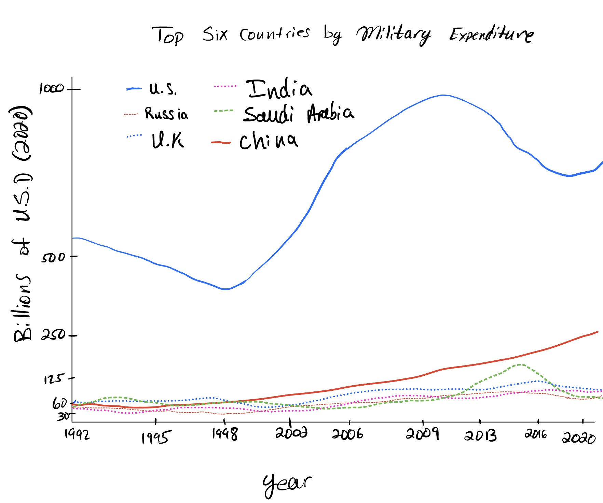

# A Critique by Design: A look at U.S. Military Spending

## Inspiration and Critique

The original data visualization behind this project comes from the Federal Reserve Bank of St. Louis in an article titled "[Military Expenditures: How Do the Top-Spending Nations Compare?](https://www.stlouisfed.org/on-the-economy/2023/jan/military-expenditures-how-top-spending-nations-compare)". As a member of the U.S. Armed Forces, I frequeltnly hear about the Untied States' military spending habits in converstaion. Some proclaim it's too high while argue claim it's not enough. Both arguments have some merit when backed with data and facts; however I baulk at strong **misinformed** beliefs. This graph was featured in a tweet by the St. Louis Federal Reserve Bank with the caption "An analysis looks at how defense spending among the nations with the highest expenditures has changed since 1992 and what may have driven the changes". Without investing the time to read --or at least conduct a full analysis of the graph, the casual viewer is at risk of receiving a message which is far from the truth. The first graph in the article can found below: 

### Top Six Countries by Military Expenditure

## Critiquing the Visualization: 

Stephen Few's [Data Visualization Effectiveness Profile](https://www.perceptualedge.com/articles/visual_business_intelligence/data_visualization_effectiveness_profile.pdf) provides the framework which I have applied to this visualization. 

The followeing categories are graded on a scale from 1 to 10 in accordance with Few's Profile:

**Usefulness: 5/10**
**Completeness: 8/10**
**Perceptibility: 2/10**
**Truthfulness: 2/10**
**Intuitiveness: 2/10**
**Aesthetics: 5/10**

### Usefulness and Completeness:
  
The graphic, if interpreted correctly, provides the relevant data for the topic. With careful inspection we can glean the spending habits of different countries. This graphic would rank much higher here if the initial impression was in keeping with the data, however it is not; in the context of data visualization, this is an issue. 

### Completeness:

The visualization provides a thorough scope of data, from 1992 to 2022. This suficiently covers modern history to show changes in military spending. Additionally, by inclduing the six highest spenders, we get a picture of how the highest countries compare. Additionally, the article later on provides a graphic of the military spending as a percent of GDP, which allows the viewer to understand the context of each country's spending habits.

### Perceptibility, Truthfulness, and Intuitiveness:

Line charts are a useful tool that allow us to quickly understand trends. Because of this, this graph is particularly misleading. The initial perception is that China overtook the U.S. in 2013, as their line intersects the United States. Even if one does notice the right-axis, it takes a mental exercise to contrast the peak values from the U.S. with those of China (the next highest country).

These are the priamry contributing factors to the low truthfullness and intuitiveness scores. The initial message is not truthful, and on the chance that a viewer does catch the complexity, it is still not intuitive to draw conclusions. It remains difficult to see how much more the U.S. spends on the military versus other countries. 

On a positive note, the authors did standardize all spending to the U.S. Dollar, which makes the graph much more truthful and intuitive. 

### Aesthetics and Engagement:

This visualization has a middle of the road score for aesthetics, as it is a simple line chart. The visuzlization utilizes space and color well. Placing the legend centered at the top makes it convenient to check, and we are able to see which lines correspond to which countries easily. I found that dollar signs in the y-axes were redundant, and the x-axis appears overcrowded. I think the visualization could do without the dollar signs, and making the x-axis more sparse, as it's obviously a continous timeline. The primary change required, which will persist, is the rectification of the dual-axis line graph. 

Regarading engagement, the visualization is not dynamic and does not allow the viewer to hover and see individual datapoint values, nor does it invite further analysis, as it is already difficult enough to understand. The primary engagement probably comes from the article, when later on it mentions how the U.S. is in fact well above China in military spending, which may cause readers to circle back to re-assess. This is not the type of engagement we want out of data visualizations. 

# Sektching a New Solution

I chose to create a simple sketch that captures the existing data without using a dual axis chart. This should simplify and highlight the truth behind the numbers. I also wanted to make sure that the x-axis would come out with less clutter and did not repeat the "$" on all of the y-axis values. 

<noscript></noscript><object class='tableauViz'  style='display:none;'><param name='host_url' value='https%3A%2F%2Fpublic.tableau.com%2F' /> <param name='embed_code_version' value='3' /> <param name='site_root' value='' /><param name='name' value='MilExpenditure&#47;Sheet1' /><param name='tabs' value='no' /><param name='toolbar' value='yes' /><param name='static_image' value='https:&#47;&#47;public.tableau.com&#47;static&#47;images&#47;Mi&#47;MilExpenditure&#47;Sheet1&#47;1.png' /> <param name='animate_transition' value='yes' /><param name='display_static_image' value='yes' /><param name='display_spinner' value='yes' /><param name='display_overlay' value='yes' /><param name='display_count' value='yes' /><param name='language' value='en-US' />
  <param name='filter' value='publish=yes' />
</object>

