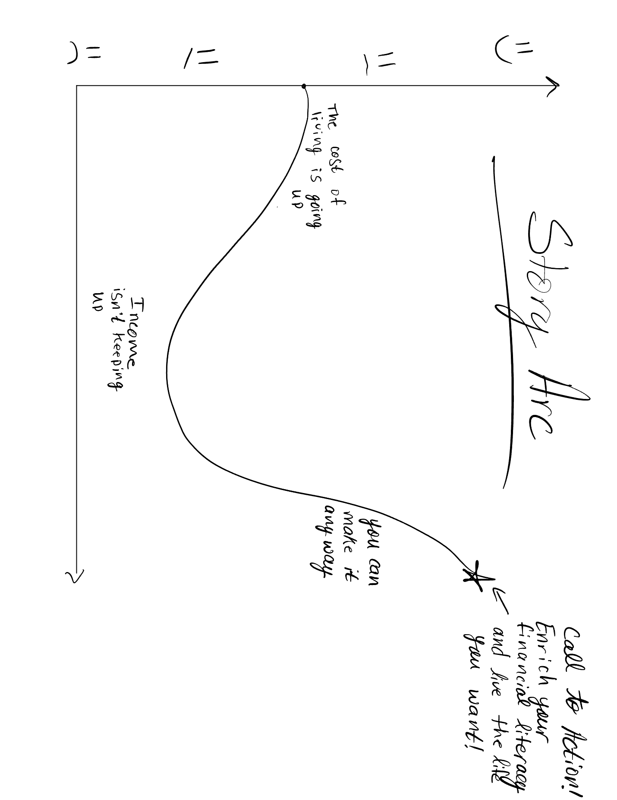
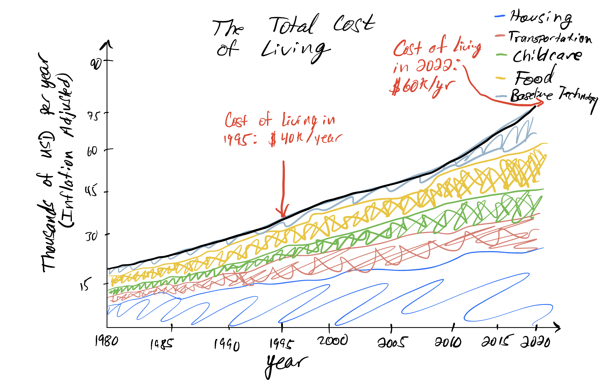
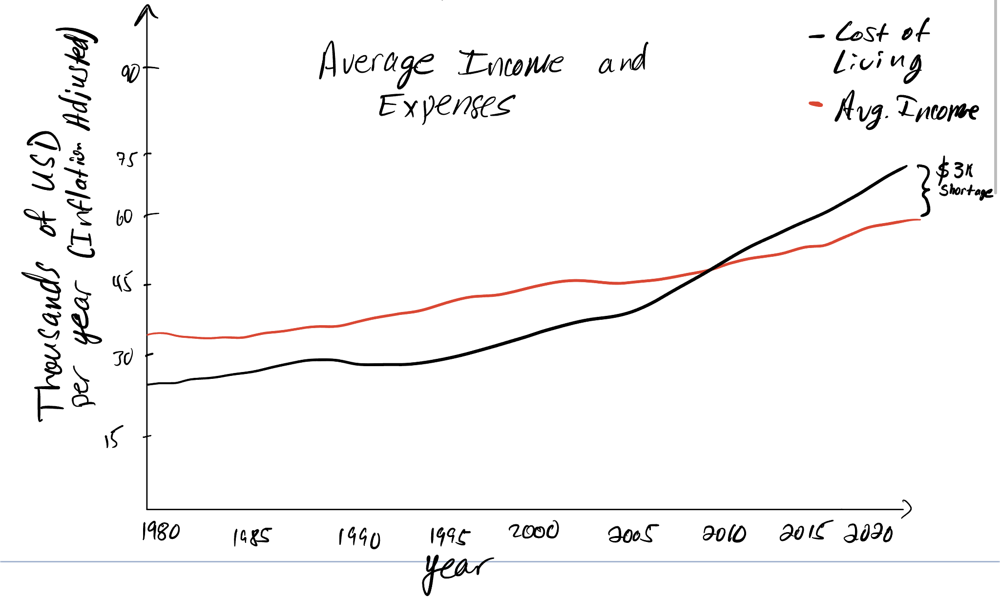

# Final Project Part 1: The importance of financial literacy for America's younger generations

In 2021 I co-founded a non-profit organization with the mission of uplifting struggling families with financial education and grants, and establish a sense of community around positive impact. We focus our impact on low-income families that inspire others with their resilience through their hard times.

The unfortunate truth is that *low income* is becoming more common throughout the younger generations in America. With the [cost of living climbing](https://www.whitehouse.gov/cea/written-materials/2021/08/11/the-cost-of-living-in-america-helping-families-move-ahead/) faster than earned wages, and [higher education becoming more cost prohibitive](https://educationdata.org/college-tuition-inflation-rate) over the last decade, it is now more important than ever for America's next generations to learn financial literacy. 

## Outline
I aim to provide data visualizations which will show how the cost of living in America has increased over the last couple - few decades. This will include some or all of the following: 
* Earned income over time
* Cost of higher education over time
* Access to healthcare (and amount of coverage)
* Cost of housing
* Cost of food
* Cost of cars and transportation
* Taxes
* Cost of energy
* Cost of childcare
* Technology Expenses
* Retirement/ Pension Plans
* Consumer Debt Interest Rates
* Cost of recreation

The idea is to paint an overall picture that we, the younger generations of America, are maturing into a financial landscape fraught with obstacles and barriers larger than our parents and grandparents ever witnessed. 

Right now, my idea to accomplish this is to first present the data to show the overall trend. Then, build a profile of an average American family in the late 1900s. We will discuss their earnings and expenses, and show their overall financial potential both during and after retirement. Then, we will constrast that with the modern American family, and hopefully the data will allow us to highlight a schism in financial preparedness. 

After painting such a dismal picture, the emphasis will shift: what do we do about it? The call to action is self education and a genuine interst in your future. Financial literacy is not taught in schools, so we must seek it. Ideally, we can show that same average average family, but with some simple financial tips and tricks to hopefully change the trajectory of their future. The call to action will focus on encourage younger adults to learn about things like debt consolidation, IRA and Roth IRA accounts, budgeting, and changing spending habits. 

## Initial Sketches

The story starts off with a downward turn, showing how the cost of living is increasing. This is exacerbated by the idea that the increase in income over time does not keep pace with the cost of living. After bringing the mood down, we will show what readers can do about it. By shifting the emphasis to enriching financial literacy, we leave the reader with a feeling of encouragement; that despite the circumstances, they can shape their future into the life they want. It will generally follow this story arc: 

My idea for these sketches is to first highlight how the aggregation of living expenses has increased over time. I will accomplish this with a stacked area chart. I chose this chart type because the specific readout values are of less impotance than the aggregate whole. 

Then, we will look at how that aggregated value has changed oveer time in comparison to the median income (I will likely use median since the mean is **highly skewed** by the elites in America). This will hopefully show an increasing desparity over time. 

This sketch illustrates the aspects of life which I have used to calculate the average cost of living in America. It includes aspects like housing, food, transportation, and childcare (adjusted for inflation). This will hopefully show that the cost of living has gone up. 

This next sketch takes the aggregation of the above data, and plots it as a line, against the average income in America to show how the difference between the two has changed. 

##  Data Sources

### Census.gov

* Income:
  * Median Income: https://www.census.gov/data/tables/time-series/demo/income-poverty/historical-income-households.html
  * Personal Income: https://www.bea.gov/data/income-saving/personal-income

* Healthcare Spending:
  * National Healthcare Spending: https://www.bea.gov/data/special-topics/health-care
  * Health Spending Tracker: https://www.healthsystemtracker.org/chart-collection/u-s-spending-healthcare-changed-time/#Total%20national%20health%20expenditures,%20US%20$%20Billions,%201970-2021

* Housing Cost:

  * 

  
## Method and Medium
